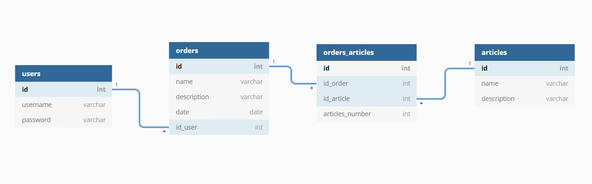

[![MIT License][license-shield]][license-url]
[![LinkedIn][linkedin-shield]][linkedin-url]

<!-- PROJECT LOGO -->
 

  <h1 align="center">Ordenes de Pago</h1>

  

    Projecto creado por:   <strong> Jose Luis Chavez Guerra </strong>
     
    <a href="https://payment-orders.herokuapp.com/docs/"><strong>Ver Documentación »</strong></a>
     
     
    ·
    <a href="https://github.com/guerracode/payment-orders/issues">Report Bug</a>
    ·
    <a href="https://github.com/guerracode/payment-orders/issues">Request Feature</a>
  

<!-- ABOUT THE PROJECT -->

## Sobre el proyecto

API para crear, leer, actualizar y eliminar Ordenes de pago y articulos.  
Con endpoint para ver ordenes por rango de fechas y enpoint para obtener los articulos mas frecuentes.

### Construido con

Estas son las principales tecnologias usadas en el proyecto:

- Node
- Express
- MySQL
- AWS RDS
- Passport
- JWT

## Diagrama de la Base de Datos

<!-- GETTING STARTED -->

## Probar el proyecto

Se le hizo deploy al proyecto por lo tanto se puede probar desde donde sea con una herramienta como **Postman**.  
Se puede descargar el poyecto y probar directamente (si se quiere hacer eso mandar correo a josephsiul15@gmail.com) para poder obtener las credenciales de connección con la Base de Datos.

### Iniciar
- Instalar [Postman](https://www.postman.com/)

- Iniciar Sesión
- Ir a **Import > Link** y pegar este link: https://www.getpostman.com/collections/ff42a1bda87314a0ef44 
- Aparecera una Colleccion en la parte izquierda la cual contiene todos los enpoints preconfigurados para hacer los requests.
- Ya solo elegir un enpoint a probar y darle en el boton de Enviar.
- Para mas informacion sobre que se envia y reciben los enpints ir a la [Documentacion](https://payment-orders.herokuapp.com/docs/).

<!-- CONTRIBUTING -->
 
 

## Contributing

Contributions are what make the open source community such an amazing place to be learn, inspire, and create. Any contributions you make are **greatly appreciated**.

1. Fork the Project
2. Create your Feature Branch (`git checkout -b feature/AmazingFeature`)
3. Commit your Changes (`git commit -m 'Add some AmazingFeature'`)
4. Push to the Branch (`git push origin feature/AmazingFeature`)
5. Open a Pull Request

## Contact

Jose Luis Chavez - [@guerracode](https://twitter.com/guerracode) - josephsiul15@gmail.com

Project Link: [GitHub](https://github.com/guerracode/payment-orders)

<!-- LINKS -->

[license-shield]: https://img.shields.io/github/license/othneildrew/Best-README-Template.svg?style=flat-square
[license-url]: https://github.com/guerracode/To-Do/blob/master/LICENSE
[linkedin-shield]: https://img.shields.io/badge/-LinkedIn-black.svg?style=flat-square&logo=linkedin&colorB=555
[linkedin-url]: https://www.linkedin.com/in/jose-luis-chavez/
